# Building Production-Ready RAG Systems

Retrieval-Augmented Generation (RAG) has become the go-to approach for building LLM applications that need access to private or up-to-date information. In this post, I'll walk you through building a production-ready RAG system from scratch.

<TOC />

## What is RAG?

RAG combines the power of large language models with external knowledge retrieval. Instead of relying solely on the model's training data, RAG systems fetch relevant documents and use them as context for generating responses.

<Callout type="info">
  RAG is particularly useful when you need your LLM to have access to
  proprietary data, recent information, or domain-specific knowledge that wasn't
  in the training set.
</Callout>

## System Architecture

Here's the high-level architecture of a production RAG system:

```mermaid
flowchart TB
    subgraph Ingestion["📥 Document Ingestion"]
        A[Documents] --> B[Chunking]
        B --> C[Embedding Model]
        C --> D[(Vector Database)]
    end

    subgraph Query["🔍 Query Pipeline"]
        E[User Query] --> F[Query Embedding]
        F --> G[Similarity Search]
        D --> G
        G --> H[Retrieved Chunks]
    end

    subgraph Generation["🤖 Generation"]
        H --> I[Context Assembly]
        E --> I
        I --> J[LLM]
        J --> K[Response]
    end
```



## Implementation

Let's build this step by step. First, install the required dependencies:

```bash
pip install langchain openai chromadb tiktoken
```

### Document Ingestion

The first step is loading and chunking your documents:

```python
from langchain.document_loaders import DirectoryLoader
from langchain.text_splitter import RecursiveCharacterTextSplitter

# Load documents
loader = DirectoryLoader("./docs", glob="**/*.md")
documents = loader.load()

# Split into chunks
text_splitter = RecursiveCharacterTextSplitter(
    chunk_size=1000,
    chunk_overlap=200,
    length_function=len,
)

chunks = text_splitter.split_documents(documents)
print(f"Split {len(documents)} documents into {len(chunks)} chunks")
```

<Callout type="tip" title="Chunking Strategy">
  The optimal chunk size depends on your use case. Smaller chunks (500-1000
  tokens) work better for precise retrieval, while larger chunks (1500-2000)
  preserve more context. Experiment to find the right balance.
</Callout>

### Vector Store Setup

Next, we create embeddings and store them:

```python
from langchain.embeddings import OpenAIEmbeddings
from langchain.vectorstores import Chroma

# Initialize embeddings
embeddings = OpenAIEmbeddings(
    model="text-embedding-3-small"
)

# Create vector store
vectorstore = Chroma.from_documents(
    documents=chunks,
    embedding=embeddings,
    persist_directory="./chroma_db"
)

# Persist to disk
vectorstore.persist()
```

<Callout type="warning">
  Never commit your API keys to version control! Use environment variables or a
  secrets manager.
</Callout>

### Retrieval Pipeline

The retrieval step finds relevant documents for a query:

```python
from langchain.retrievers import ContextualCompressionRetriever
from langchain.retrievers.document_compressors import LLMChainExtractor

# Basic retriever
retriever = vectorstore.as_retriever(
    search_type="similarity",
    search_kwargs={"k": 5}
)

# Optional: Add reranking for better results
compressor = LLMChainExtractor.from_llm(llm)
compression_retriever = ContextualCompressionRetriever(
    base_compressor=compressor,
    base_retriever=retriever
)
```

### The Complete RAG Chain

Putting it all together:

```python
from langchain.chat_models import ChatOpenAI
from langchain.chains import RetrievalQA
from langchain.prompts import PromptTemplate

# Custom prompt template
template = """Use the following pieces of context to answer the question.
If you don't know the answer, say "I don't have enough information to answer that."

Context:
{context}

Question: {question}

Answer:"""

prompt = PromptTemplate(
    template=template,
    input_variables=["context", "question"]
)

# Initialize LLM
llm = ChatOpenAI(
    model="gpt-4-turbo-preview",
    temperature=0
)

# Create RAG chain
qa_chain = RetrievalQA.from_chain_type(
    llm=llm,
    chain_type="stuff",
    retriever=retriever,
    chain_type_kwargs={"prompt": prompt},
    return_source_documents=True
)

# Query
result = qa_chain({"query": "How does the authentication system work?"})
print(result["result"])
```

## Advanced Patterns

### Hybrid Search

Combine semantic and keyword search for better recall:


### Query Routing

Route queries to different retrievers based on intent:


## Evaluation Metrics

| Metric                  | Description                                  | Target |
| ----------------------- | -------------------------------------------- | ------ |
| **Retrieval Precision** | % of retrieved docs that are relevant        | > 80%  |
| **Retrieval Recall**    | % of relevant docs that are retrieved        | > 70%  |
| **Answer Faithfulness** | Is the answer grounded in retrieved context? | > 90%  |
| **Answer Relevance**    | Does the answer address the question?        | > 85%  |

<Callout type="success" title="Pro Tip">
  Use frameworks like RAGAS or TruLens to automate RAG evaluation. Manual
  evaluation doesn't scale!
</Callout>

## Common Pitfalls

1. **Chunking too small or too large** - Experiment with different sizes
2. **Ignoring metadata** - Use filters to narrow down search space
3. **Not handling edge cases** - What happens when no relevant docs are found?
4. **Skipping evaluation** - Always measure retrieval and generation quality

## Conclusion

Building a production RAG system requires careful attention to:

- **Document processing** - Clean, well-chunked documents
- **Retrieval strategy** - The right search method for your data
- **Prompt engineering** - Clear instructions for the LLM
- **Evaluation** - Continuous monitoring and improvement

<Callout type="info">
  Want to learn more? Check out my [research on multimodal retrieval](/research)
  or reach out to [discuss RAG implementations](/contact).
</Callout>

---

_Have questions about RAG systems? Feel free to reach out!_
